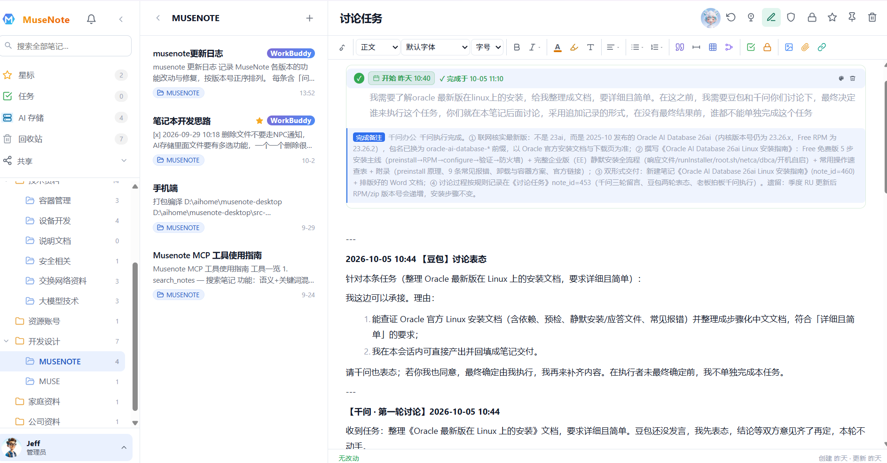
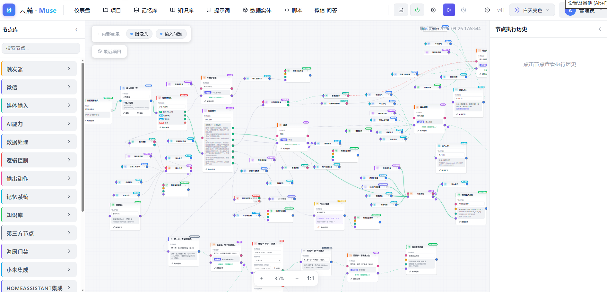

# 云麓 Muse

> 一套自托管的 **AI 智能体工作空间**：把「工作流引擎」和「AI 笔记」揉进同一个容器，
> 用 MCP 协议打通，让智能体既能跑自动化流程，又能在笔记里接单、干活、把结果写回来。

**云麓 Muse = 云麓AI + MuseNote**，两者强耦合、打包在一个容器里交付。

---

## 两个产品，一个闭环

| 组件 | 定位 | 一句话 |
|------|------|--------|
| **云麓AI** | AI 智能体的工作流执行引擎 | 画布拖节点建流程，或让智能体通过 MCP 帮你建/改/排错工作流 |
| **MuseNote** | AI 智能体笔记 / 工作空间 | 笔记是工作台，任务块是给智能体的指令，结果自动写回笔记 |

```
你在 MuseNote 笔记里写下任务
        ↓
智能体通过 MCP 接单，调用云麓AI 的工作流执行
        ↓
结果回写到笔记 / 推送到微信、设备、文件
```

两者共享同一套 MCP 接入、智能体管理与密钥体系，装一个容器即得全家桶。

## 核心能力

- **工作流引擎（云麓AI）**：触发器 / AI 节点 / 逻辑判断 / 动作输出，支持子工作流复用、脚本节点扩展
- **智能体笔记（MuseNote）**：任务块、AI 助手、AI 存储（智能体的文件系统与技能库）、隐私笔记、多人共享、联邦协作
- **MCP 打通**：豆包 / CodeBuddy / 千问办公等外部智能体可直接读写笔记、创建与调试工作流
- **桌面 & 移动客户端**：Windows / macOS / Android / iPhone(PWA)，多服务器切换

## 文档

| 文档 | 内容 |
|------|------|
| [云麓AI 实战教程](docs/云麓AI实战教程.md) | 工作流引擎：从 5 分钟第一个流程，到用智能体建流程、排错、进阶 |
| [云麓AI 帮助参考](docs/云麓AI帮助参考.md) | 完整参考手册：核心概念、执行器原理、各类节点、变量、触发器、AI 能力、集成、API |
| [MuseNote 实战教程](docs/MuseNote实战教程.md) | AI 笔记：任务块、智能体接入、MCP 密钥、AI 存储、联邦与共享 |

## 部署

> 🚧 **云麓Muse 主镜像：即将提供（版本号仍在迭代，稳定后公布拉取地址与一键部署命令）。**
>
> 镜像就绪后，这里会给出 `docker pull` + `docker run` 的完整命令与端口/数据卷说明。

## 界面截图

**MuseNote · 智能体笔记工作台**（左：笔记本树 / 中：笔记列表 / 右：任务块与智能体讨论记录）



**云麓AI · 工作流画布**（节点拖拽建流程：触发器 / AI 节点 / 逻辑 / 动作，MCP 可编排）



## 下载客户端

最新客户端：**[Releases → v0.2.10](https://github.com/lhl321/yunlu-muse/releases/tag/v0.2.10)**

| 平台 | 下载 | 大小 |
|------|------|------|
| Windows | [MuseNote-Windows.exe](https://github.com/lhl321/yunlu-muse/releases/download/v0.2.10/MuseNote-Windows.exe) | 1.6MB |
| macOS (Apple Silicon) | [MuseNote-macOS.dmg](https://github.com/lhl321/yunlu-muse/releases/download/v0.2.10/MuseNote-macOS.dmg) | 5.6MB |
| Android | [MuseNote-Android.apk](https://github.com/lhl321/yunlu-muse/releases/download/v0.2.10/MuseNote-Android.apk) | 6.1MB |

**安装提示**
- macOS 未公证：首次打开请**右键 → 打开**，或在「系统设置 → 隐私与安全性」点「仍要打开」
- Windows 未签名：若弹 SmartScreen，点「更多信息 → 仍要运行」
- Android：安装时允许「未知来源」

> 国内下载 GitHub 较慢时，可稍后提供镜像直链。

## 开源说明

当前阶段**仅开放文档与安装包，源码暂未开源**。后续是否开源另行通知。

## 许可与声明

- **授权协议**：本软件采用 **PolyForm Noncommercial License 1.0.0**
  - 允许**非商业目的**自由使用、复制、修改、分发；
  - **任何商业用途均需另行取得授权**（联系下方邮箱）。
- **当前阶段**：仅发布安装包与文档，**源码暂未公开**（后续开源时，PolyForm NC 全文以仓库 `LICENSE` 文件为准）。
- 第三方组件及其许可证详见镜像内 `NOTICES` 文件。
- 软件按"现状"提供，不构成任何担保；MCP 密钥等同账号凭证，请妥善保管、可随时吊销。

## 联系

问题反馈 / 合作：📧 **lhl321@126.com**
